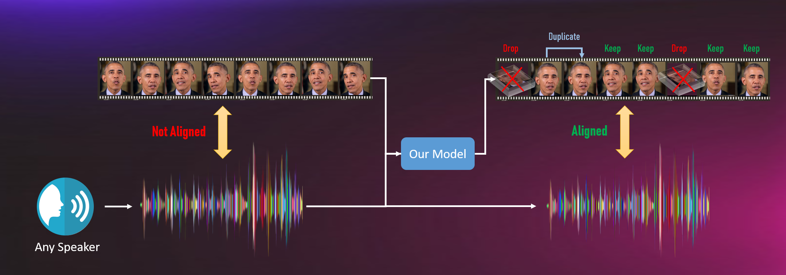
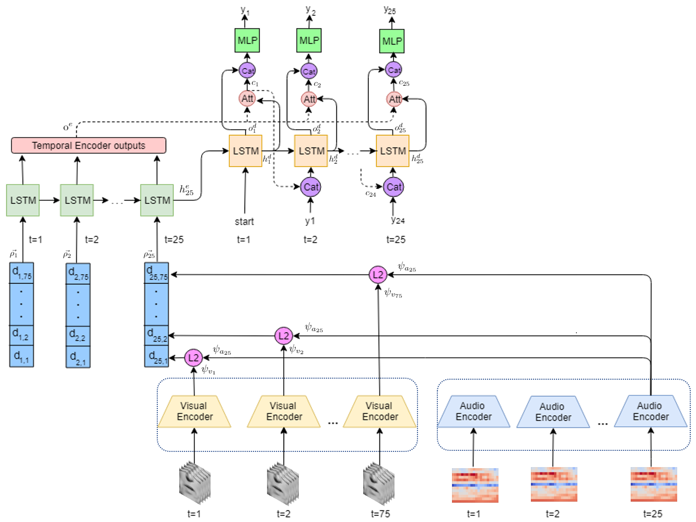

# PyTorch Implementation of [End to End Lip Synchronization with a Temporal AutoEncoder](http://arxiv.org/abs/2203.16224) [WACV 2020]
[[Paper]](http://arxiv.org/abs/2203.16224)

See sample results in samples/main.html.


## <u>Method Overview</u>
<br/>

Click to watch on YouTube:

[](https://www.youtube.com/watch?v=LLRnTPoMP_E)


<br/>



<br/>



## <u>Installation</u>
Tested using python 3.6.7.

You can install this repo as a Python package:
```bash
$ conda install pytorch==1.0.1 torchvision==0.2.2 cudatoolkit=10.0 -c pytorch
$ pip install git+https://github.com/itsyoavshalev/End-to-End-Lip-Synchronization-with-a-Temporal-AutoEncoder.git
```
Next, compile and install OpenFace 2.1.0 into ./OpenFace/ (https://github.com/TadasBaltrusaitis/OpenFace).

## <u>Datasets</u>
For TIMIT, you should first run Utils/preprocess_TIMIT_db.py.
<br/>
In order to generate a dataset, first configure dbs_config.yaml, then run db_gen.py (supports lrs2-BBC and TCD-TIMIT), Utils/generate_frames_from_videos.py and Utils/generate_acnhors.py.

When generating a validation or a test dataset, run Model/genrate_test_db.py as well.

## <u>Initial Training Phase</u>
Use scripts in ./SyncNet.
</br>
After training, the output folder will contain the inital training weights for the final training phase.

## <u>Final Training Phase</u>
Run Model/train.py.